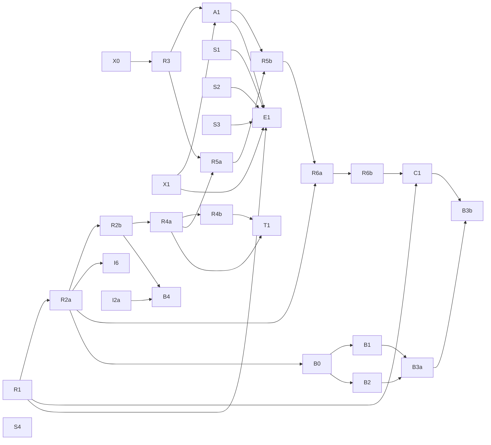

# Build Plan — Copilot subsystem

> The roadmap for building the copilot: every ticket, **both** dependency graphs, and how to work it.
> Tickets are GitHub issues in `aarush-dev/mpls-lab`. Design = `docs/adr/`, spec = issue #3,
> vocabulary = `CONTEXT.md`.

## How to read this

- **39 tickets** (#4–#42), each sized for **one coding-agent session**. Every ticket carries its own
  read-first context, acceptance criteria, a **Modifies** list, a **Consumes stub** line, and
  native `blocked_by` edges. (Count history: the original set was **34** (#4–#37) — the build
  transcript's "≈31" was an approximation that hardened into a wrong "31"; its own label table sums
  to 34. The 2026-08-03 repair added #38–#40; the audit added #41–#42.)
- **Single track.** One builder. The original two-lane split (Lane-Investigation / Lane-Runtime,
  disjoint file ownership) is **withdrawn** — with a single builder, lane ownership is moot, and the
  modification graph below shows the vertical-slice tickets were never cleanly disjoint anyway.
- **A ticket is grabbable when all its blockers are closed.** Frontier query at the bottom.

## What went wrong (read this before adding a ticket)

The original plan carried **one** graph, labelled "A → B = A must close before B can start" — a
**start-order** graph — and it was read as if it were a **modification** graph. Two failures:

1. **The adapter stub had no replacing ticket.** F2 (#6) shipped a `ToolAdapter` interface +
   `StubAdapter` returning canned rows — exactly its stated scope — and **no ticket in the original
   34 replaced it**. So today `/chat` returns `503` from `get_adapter` (`copilot/api/app.py:50-52`).
   **#40 (A1)** is the ticket that was missing.
   *Note the LLM stub was **not** in the same boat:* `ScriptedLLM` was always owned by **R1 (#16)** —
   see `copilot/api/app.py:46` (`R1 ships the real HTTP one`) and the original R1 scope. The
   finished-state-`503` was caused by the missing **adapter** ticket alone, not by two orphaned
   stubs. Real-adapter contact was also always implied by the approved test strategy ("a few real
   integration tests… the adapter's real query strings" + manual E2E) — it was a ticketing gap, not
   a decision that stubs were terminal.
2. **The lanes were never cleanly disjoint.** By the modification table below, **9 of 10 R tickets**
   edit I/F-lane files (only R5a is clean), while every ticket body said "touch only your lane's
   subpackage". Related smell: `MAX_LIMIT` (`adapter/contract.py:16-18`), `DEFAULT_HOPS`
   (`tools/registry.py:53-54`) and `COPILOT_KG_URI` (`api/app.py` `get_kg`, via env) all live
   outside `config.py`; **consolidate them into `config.py` in A1/R1**. (Whether the lane rule
   *caused* that scatter is not established — treat it as cleanup, not a proven causal story.)

The standing fix is the **codependency check** in `CLAUDE.md`: every ticket declares start-order
**and** modification edges, and a produced signal with no consumer is a missing ticket to write.

## Ticket index

### Done
| Code | # | Delivers | Ran on |
|---|---|---|---|
| F0 | 4 | config + `copilot/` module skeleton | — |
| F1 | 5 | LLM-client seam (interface + `ScriptedLLM`) | stub only |
| F2 | 6 | tool-adapter seam (interface + `StubAdapter` + mandatory-filter contract) | stub only |
| F3 | 7 | agent loop core (`query_metrics`, caps, ask-back) | stub + stub |
| F4 | 8 | FastAPI endpoint + timestamped trace | stub + stub |
| I1 | 9 | `search_logs` + `flows` tools | `StubAdapter` |
| I2a | 10 | Retriever interface + embedded LanceDB + embedder profile | **real LanceDB**, `HashEmbedder` |
| I2b | 11 | `search_runbooks` + `search_incidents` (+ topology-hop filter) | real LanceDB + `StubAdapter` |
| I3 | 12 | `walk_topology_graph` (BFS + `/metrics` enrich, `kg` flag) | `StubAdapter` (BFS real, enrich canned) |
| I4a | 13 | quality gate: deterministic pre-gate + citation check | **pure functions, no doubles** |
| I4b | 14 | quality gate: self-judge + ≤2 agentic retry | `ScriptedLLM` (verdicts are test literals) |
| I5 | 15 | diagnostic skills loader (progressive disclosure, manual invoke) | real loader, **no content** (S3) |
| X0 | 38 | codependency rule + graph repair | — |
| B0 | 28 | workspace scaffolding (`copilot/workspace/`) + path policy | real (no doubles) |
| B1 | 29 | workspace file tools `read/write/edit` + little-coder invariants | real (no doubles) |
| B2 | 30 | subprocess executor (no-net `unshare -n` + timeout + cwd, fail-closed) | **real sandbox** |
| B3a | 31 | wire the `bash` tool to the executor (loop + HTTP, per-session) | real (no doubles) |
| B3b | 32 | snapshot-on-present into `artifacts/` + `artifact` event (backend) | real (no doubles) |
| B4 | 33 | `ledger→KB` loop: case verdict → KB incident doc (flag `ledger_to_kb`, default on) | real (LanceDB) |

### The spine — makes the above true
| Code | # | Delivers |
|---|---|---|
| X1 | 39 | redeploy full lab + verify dataapi serves live data |
| R3 | 19 | `WindowContext` (live / query / forensic) + the forensic freeze guard |
| A1 | 40 | **real HTTP tool adapter over dataapi** (replaces `StubAdapter`) |
| R1 | 16 | real LLM backend profiles **+ the loop message-assembly fix** (narrow: fake-server + 1 smoke, not live-lab) |
| R2a | 17 | session store (`sessions/<id>/{events.jsonl,meta.json}`) + multi-turn loop entry (`history`) + emit-time event ts + gate-on-pass |
| R2b | 18 | Event Ledger (`copilot/memory/ledger.py` — append-only SQLite, idempotent by record id, query by device / time range) + gate outcomes routed in via F4 (`api/app.py`) |
| R4a | 20 | PA-emulator core (`copilot/emulator/emulate.py` — ground-truth `/labels` → full §3.3 record, oracle-deterministic) + `emulate_pa` seam + `persist`→ledger; `abstain`→gate soften + `fault_type`→skill steer; resolved §3.3.1 (health in-record, `n_concurrent`) |
| R4b | 21 | emulator `error_profile` knobs (confusable cause + evolving R0–R5 drift) + `emulator/predictor.py` periodic firing loop (`predict_once`/`run_predictor`, reads `cfg.predict_interval_s`, ADR-0014); gate interaction exercised via #20's `abstain` lever (see §gate-stress caveat, #21) |
| E1 | 42 | **end-to-end: real chat on real model + real dataapi + seeded KB** |

**#42 (E1) closing is the first moment `/chat` answers a real question end to end** — not #16. R1 is
now a config-swap tested against a fake OpenAI-shaped server + one smoke call; the honest end-to-end
gate is E1, which needs R1 + A1 + X1 + the seeds together.

### Remaining Milestone A
| Code | # | Delivers |
|---|---|---|
| R5a | 22 | forensic trigger: 10 s loop, alert, episode dedup, restart-safe |
| R5b | 23 | case creation + **file-backed replay adapter** |
| R6a | 24 | multi-chat per case + follow-up over frozen window |
| R6b | 25 | concurrent faults: n chats + master synthesis (+ gate change) |
| T1 | 41 | **trust gate: distrust a degraded model** (consumes #21's drift/health scalar) |
| C1 | 27 | ~~demo web app~~ **descoped** (UI = separate team, ADR-0010 Amended); live-flush streaming ships in the API (F4) |

### Milestone B — coding agent (after A)
| Code | # | Delivers |
|---|---|---|
| B0 | 28 | workspace scaffolding + path policy | **done** |
| B1 | 29 | workspace file tools `read/write/edit` + invariants | **done** |
| B2 | 30 | subprocess executor (no-net, timeout, cwd) | **done** |
| B3a | 31 | wire the `bash` tool to the executor | **done** |
| B3b | 32 | artifacts (snapshot-on-present) + `artifact` event | **backend done** (render = C1/#27) |
| B4 | 33 | `ledger→KB` loop (flag, default on) | **done** |

### Seeding — content, non-blocking, grab any time
| Code | # | Delivers |
|---|---|---|
| S1 | 34 | incident corpus seed (from 21 fault types) |
| S2 | 35 | runbook corpus expand |
| S3 | 36 | diagnostic skills content seed |
| S4 | 37 | eval scenarios seed (labelled) |

S1–S3 have no technical blockers, but until they land, `search_runbooks`, `search_incidents` and
`load_skill` are **inert at runtime** — real code over an empty corpus. Grab them before E1 (#42).

## Graph 1 — start order

`A → B` = A must close before B can start.



R1 (#16) is **no longer** downstream of A1 — it is narrow and needs only F1. A1 and R1 both feed E1
(#42), the real end-to-end gate. T1 (#41) consumes R4a/R4b's drift scalar.

## Graph 2 — modification edges

Which tickets **edit files another ticket already shipped**. A ticket is not schedulable in parallel
with anything it shares a row with.

| Ticket | Edits | Why |
|---|---|---|
| **R3** #19 | `adapter/contract.py`, `adapter/stub.py`, `tools/registry.py`, `agent/gate.py`, `agent/loop.py`, `api/app.py` | ADR-0002: the window is threaded into **every** tool call and the freeze is enforced **at the adapter**. 7 bare `start, end = window` unpack sites. |
| **A1** #40 | `api/app.py` (`get_adapter`), `tools/registry.py` (transport errors), `config.py` | replaces the stub; needs a base URL that exists nowhere today. |
| **R1** #16 | `agent/loop.py:203` (assistant `tool_calls` dropped), `tools/registry.py:61` + `agent/loop.py:91` (two copies of the flat tool-spec shape), `agent/loop.py:104` (ReAct parser), `config.py:49,68` | ADR-0004. A real backend rejects the current message assembly. |
| **R2a** #17 | `agent/loop.py:122,155` (single-shot → multi-turn), `api/app.py` (`ChatRequest`, session id), `agent/loop.py:46` (emit-time ts), `:185` (gate event on pass) | ADR-0009. Resume is a loop change, not a writer. |
| **R2b** #18 | `memory/ledger.py` (new), `api/app.py` (gate outcomes → ledger via F4) | ADR-0009. Routed through F4's event pipeline (not the I4b emit site) — reuses the single `event_wire` schema. |
| **R4a** #20 ✅ | `emulator/emulate.py` (new — producer + `emulate_pa` seam + `persist`), `agent/gate.py` (`abstain` softens sufficiency, keeps integrity), `agent/loop.py` + `skills/loader.py` (`fault_type_hint` steers), `docs/plans/PA.md` §3.3.1/§3.5 (health-in-record + `n_concurrent` resolved) | ADR-0008 §Nuances, ADR-0012 §Decision, ADR-0003. Consumer **hooks** land here (tested end-to-end producer→gate/skills); the **runtime callers** are named downstream — periodic firing that writes records to the ledger = R4b/#21 (ADR-0014 `predict_interval_s`, still unread until then), forensic chat that threads a frozen record into `investigate()` = R5. §3.3.1 unblocks T1/#41. |
| **R4b** #21 ✅ | `emulator/predictor.py` (new — `predict_once` + `run_predictor` periodic loop, reads `cfg.predict_interval_s` + `fetch_labels` + `persist`s every tick, ADR-0014), `emulator/emulate.py` (confusable-cause `_confuse` + evolving `_drift(profile, tick)` R0–R5 ladder; `drift_tick` threaded through `emulate_record`/`prediction`) | R4a left `predict_interval_s` unread by design — `predictor.py` now owns it. **Gate-stress caveat:** the only deterministic record→gate lever is `abstain` (ADR-0008), which *relieves* the gate; the literal "heavy → higher block rate" is LLM-skill-mediated (ADR-0012, same-family confusion mis-steers skill choice) and surfaces only when a real record threads into a live `investigate()` at runtime (R5 forensic loop, #22/#23), not unit-deterministic. R4b delivers the knobs + loop + the honest wired abstain-lever demo; the block-rate demonstration is owned by R5's real-LLM forensic run (flagged on #21). *(E1/#42 is a manual real-chat harness — already closed — and never measured profile gate-stress, so it can't own this.)* |
| **R5a** #22 | *nothing outside `forensic/`* | **the one honest ticket in the original plan.** Keep it that way. |
| **R5b** #23 | `adapter/` (file-backed replay adapter), `agent/loop.py` + `agent/gate.py` (`case.md` format) | #23 wants "replayable from disk"; tools only read via `ToolAdapter`. ADR-0010 §Open is unresolved. |
| **R6a** #24 | `agent/loop.py` (multi-turn), `api/app.py` (case/session routing), `adapter/contract.py` (freeze bites) | follow-ups are multi-turn and frozen. |
| **R6b** #25 | `agent/gate.py` | a synthesis gathers 0 cites → `pre_gate` "thin evidence"; every device token → "uncited claim". |
| **T1** #41 | `agent/gate.py`, `config.py` | a trust check keyed on the drift scalar, beside pre-gate/citation. |
| **C1** #27 | `agent/loop.py` (yield per step), `api/app.py:123-130` | `_sse()` iterates events **after** `investigate()` returns — it is not streaming. |

## Build order

1. **#38 (X0)** done. **#39 (X1)** — the long one (full lab deploy), run early; E1 needs it.
2. **#19 (R3)** — WindowContext, before the adapter so the adapter is written once.
3. **#40 (A1)** — the real adapter. First time any copilot code touches `dataapi`.
4. **#16 (R1)** — real client + the loop fixes it forces (fake-server + 1 smoke; not gated on the lab).
5. **#34–#36 (S1–S3)** — seed the corpora so retrieval and skills stop being inert. **DONE.**
6. **#42 (E1) — DONE.** The real end-to-end run: `copilot/e2e/harness.py` drives real gpt-oss-20b
   (NVIDIA-hosted nim) + live dataapi + real nv-embedqa KB, **zero doubles**. `/chat` answers end
   to end. Record: `copilot/e2e/REPORT.md` + `traces/`. Regressions filed, not patched: **#43**
   (gpt-oss range/unicode citations the gate rejects), **#44** (embedder query/passage asymmetry —
   **fixed**: `encode(texts, kind)`, add=passage/search=query, `NimEmbedder` maps kind→input_type
   under `COPILOT_EMBED_INPUT_TYPE=auto`),
   **#45** (harmony `<|channel|>` leak into tool-call names), **#46** (all-None-node retrieval
   crash — **fixed** in the E1 commit: `store.py` pins the pyarrow schema).
7. **#17 → #18** (memory), then **#20 → #21** (emulator) → **#41 (T1, trust gate)**.
8. **#22 → #23 → #24 → #25** (forensic chain — the long pole).
9. **#26 (I6)** any time after #17. **#27 (C1)** after #25.
10. **Milestone B**: #28 → (#29 ∥ #30) → #31 → #32; #33 independent.
11. **#37 (S4)** any time.

## Critical path

`X0 → R3 → A1 → E1` gates the first real answer, with `X1` + `S1–S3` feeding E1 alongside. The long
pole is the forensic chain: `R2a → R2b → R4a → R5a → R5b → R6a → R6b → C1 → B3b`. R1 sits off to the
side (F1 → R1 → E1), no longer serialised in front of the memory/forensic work.

## Known gaps with no ticket

- **Interface error counters** are structurally dead in containers (see `HANDOFF.md`), so any copilot
  behaviour keyed on them cannot be demonstrated on this lab.

(The **trust gate** — spec #3 story 14 — is now **#41 (T1)**, no longer an untracked gap.)

## How each session runs

1. Pick an unblocked ticket (frontier query below). Assign yourself.
2. Read the ticket's context header: `CONTEXT.md` → spec #3 → the ADR(s) it names.
3. Check its **Modifies** and **Consumes stub** sections before writing anything. If it consumes a
   stub with no replacing ticket, stop and write that ticket first (`CLAUDE.md` codependency check).
4. Build test-first (`/tdd`) at the seams.
5. `/code-review` the diff, commit + push to `main` (author = Aarush, no AI trailers).
6. Docs: **minor tracking docs** (this plan, `HANDOFF.md`, PLAN.md status, component READMEs) in the
   same commit; **decision records** (ADRs, SPEC-NOTES) when a decision changes; **major docs**
   (`docs/01_…`–`05_…`) only at a **milestone boundary**, not per sub-ticket (CLAUDE.md §Documentation).
7. Clear context. Next ticket.

**Frontier query** (everything grabbable right now — open, with no open blocker):
```bash
gh issue list --repo aarush-dev/mpls-lab --state open --limit 40 \
  --json number,title,blockedBy \
  --jq '.[]|select([.blockedBy.nodes[]|select(.state=="OPEN")]|length==0)|"\(.number)\t\(.title)"' | sort -n
```
As of the audit: **#19 (R3)** and **#39 (X1)** move the spine; **#34–#37 (S1–S4)** are always
grabbable filler.

## Milestones

- **Milestone A = Investigator** (F0–F4, I1–I6, X0/X1/A1, R1–R6b, T1, C1, E1) — a complete, demoable
  copilot running on real telemetry and a real model.
- **Milestone B = Coding agent** (B0–B4) — adds sandboxed code execution + artifacts.
- **Deferred (post-build):** the eval scoring harness (ADR-0017) — tool-usage data accrues free via
  `events.jsonl` meanwhile.
