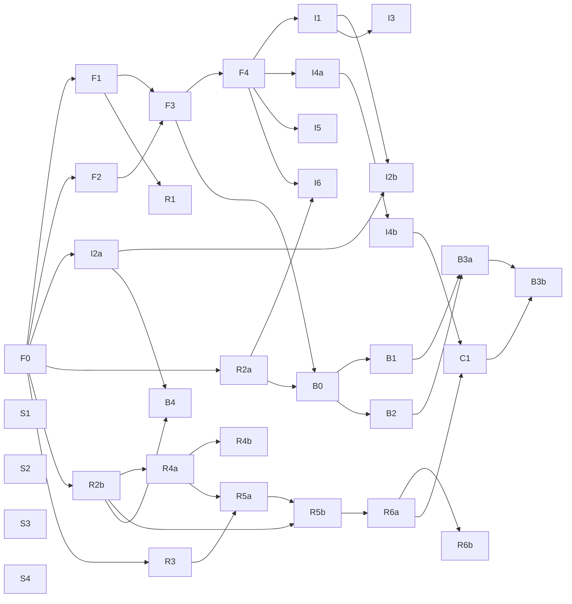

# Build Plan — Copilot subsystem

> The roadmap for building the copilot: every ticket, the dependency graph, the two parallel lanes,
> and how to work it. Tickets are GitHub issues in `aarush-dev/mpls-lab`. Design = `docs/adr/`,
> spec = issue #3, vocabulary = `CONTEXT.md`.

## How to read this

- **31 tickets**, each sized for **one coding-agent session**. Every ticket is `ready-for-agent` and
  carries its own read-first context + acceptance criteria + native `blocked_by` edges.
- **Two lanes** so **two people build in parallel** with disjoint file ownership:
  - **Lane-Investigation** (Dev 1) — `copilot/{adapter,tools,retrieval,agent,skills}`
  - **Lane-Runtime** (Dev 2) — `copilot/{llm,memory,window,emulator,forensic}`
- **A ticket is grabbable when all its blockers are closed.** Frontier query at the bottom.

## Ticket index (code → issue → what it delivers)

### Foundation (skeleton — do first)
| Code | # | Lane | Delivers |
|---|---|---|---|
| F0 | 4 | foundation | config + `copilot/` module skeleton (blocks everything) |
| F1 | 5 | runtime | LLM-client seam (interface + scripted stub) |
| F2 | 6 | investigation | tool-adapter seam (interface + stub + mandatory-filter contract) |
| F3 | 7 | investigation | agent loop core (`query_metrics`, caps, ask-back) |
| F4 | 8 | convergence | FastAPI endpoint + streamed timestamped trace (the HTTP behaviour seam) |

### Lane-Investigation (Dev 1)
| Code | # | Delivers |
|---|---|---|
| I1 | 9 | `search_logs` + `flows` tools |
| I2a | 10 | Retriever interface + embedded LanceDB + embedder profile |
| I2b | 11 | `search_runbooks` + `search_incidents` (+ topology-hop filter) |
| I3 | 12 | `walk_topology_graph` (BFS + `/metrics` enrich, `kg` flag) |
| I4a | 13 | quality gate: deterministic pre-gate + citation check |
| I4b | 14 | quality gate: self-judge + ≤2 agentic retry |
| I5 | 15 | diagnostic skills loader (progressive disclosure, manual invoke) |
| I6 | 26 | history compaction (config-gated) |

### Lane-Runtime (Dev 2)
| Code | # | Delivers |
|---|---|---|
| R1 | 16 | real LLM backend profiles (nim / unsloth swap) |
| R2a | 17 | session store + `events.jsonl` (resumable) |
| R2b | 18 | Event Ledger (append-only records store) |
| R3 | 19 | `WindowContext` (live / query / forensic) |
| R4a | 20 | PA-emulator core: ground-truth → §3.3 record (oracle) |
| R4b | 21 | emulator `error_profile` + drift/health knobs |
| R5a | 22 | forensic trigger: 10s loop, alert, episode dedup, restart-safe |
| R5b | 23 | case creation: freeze window copy + `prediction.json` + initial `case.md` |
| R6a | 24 | multi-chat per case + follow-up over frozen window |
| R6b | 25 | concurrent faults: n chats + master synthesis |

### Convergence
| Code | # | Delivers |
|---|---|---|
| C1 | 27 | demo web app (consumes the trace) |

### Milestone B — coding agent (after A)
| Code | # | Lane | Delivers |
|---|---|---|---|
| B0 | 28 | foundation | workspace scaffolding + path policy |
| B1 | 29 | investigation | workspace file tools `read/write/edit` + invariants |
| B2 | 30 | runtime | subprocess executor (no-net, timeout, cwd) |
| B3a | 31 | convergence | wire the `bash` tool to the executor |
| B3b | 32 | convergence | artifacts (snapshot-on-present) + demo render |
| B4 | 33 | runtime | `ledger→KB` loop (flag, default on) |

### Seeding — content, anyone, non-blocking
| Code | # | Delivers |
|---|---|---|
| S1 | 34 | incident corpus seed (from 21 fault types) |
| S2 | 35 | runbook corpus expand |
| S3 | 36 | diagnostic skills content seed |
| S4 | 37 | eval scenarios seed (labelled) |

## Dependency graph

`A → B` = A blocks B (A must close before B can start).



Cross-lane edges (the only coupling points): **I6←R2a**, **C1←(I4b, R6a)**, **B0←(F3, R2a)**,
**B3b←C1**, **B4←(I2a, R2b)**. Everything else stays within one lane.

## Build order

1. **F0** first, solo — one session. Blocks the world.
2. After F0, the lanes diverge and run **in parallel**:
   - Immediately unblocked: **F1, F2** (skeleton), **I2a** (Dev 1), **R2a, R2b, R3** (Dev 2).
   - Skeleton finishes when **F3 → F4** land (F3 needs F1+F2).
3. Once **F4** is in, Lane-Investigation opens up (I1, I4a, I5, I6…) and Lane-Runtime continues
   (R1, R4a → R4b → R5a → R5b → R6a → R6b).
4. **C1** (demo) is the first convergence — needs **I4b + R6a**.
5. **Milestone B** starts once **B0** unblocks (needs F3 + R2a): B1 (Dev 1) ∥ B2 (Dev 2) → B3a → B3b; B4 independent.
6. **Seeding (S1–S4)** has no blockers — grab any time as filler between tasks (code ships on fixtures).

## Critical path (longest chain)

`F0 → R2b → R4a → R5a → R5b → R6a → C1 → B3b` (plus `F0 → F1/F2 → F3 → F4` for the skeleton the rest
hangs off). Lane-Runtime's forensic chain (R4a→R5a→R5b→R6a) is the long pole — start it early.

## How each session runs

1. Pick an unblocked ticket in your lane (frontier query below). Assign yourself.
2. Read the ticket's context header: `CONTEXT.md` → spec #3 → the ADR(s) it names.
3. Build test-first (`/tdd`) at the seams (HTTP behaviour; stub the LLM + adapter).
4. `/code-review` the diff, commit + push to `main` (author = Aarush, no AI trailers, docs in the same commit).
5. Clear context. Next ticket.

**Frontier query** (unblocked tickets in your lane):
```bash
gh issue list --repo aarush-dev/mpls-lab --label lane-runtime --state open \
  --json number,title,issueDependenciesSummary \
  --jq '.[] | select(.issueDependenciesSummary.blockedBy==0) | "\(.number) \(.title)"'
```
(swap `lane-runtime` for `lane-investigation`, or `seeding` for filler.)

## Milestones

- **Milestone A = Investigator** (F0–F4, I1–I6, R1–R6b, C1) — a complete, demoable, read-only copilot.
- **Milestone B = Coding agent** (B0–B4) — adds sandboxed code execution + artifacts; layers on A's loop.
- **Deferred (post-build):** the eval scoring harness (ADR-0017) — tool-usage data accrues free via
  `events.jsonl` meanwhile.
