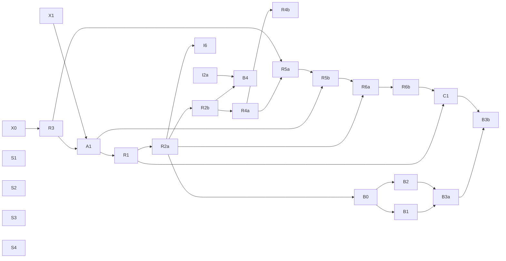

# Build Plan — Copilot subsystem

> The roadmap for building the copilot: every ticket, **both** dependency graphs, and how to work it.
> Tickets are GitHub issues in `aarush-dev/mpls-lab`. Design = `docs/adr/`, spec = issue #3,
> vocabulary = `CONTEXT.md`.

## How to read this

- **34 tickets**, each sized for **one coding-agent session**. Every ticket carries its own
  read-first context, acceptance criteria, a **Modifies** list, a **Consumes stub** line, and
  native `blocked_by` edges.
- **Single track.** The original two-lane split (Lane-Investigation / Lane-Runtime, disjoint file
  ownership) is **withdrawn** — see *What went wrong* below.
- **A ticket is grabbable when all its blockers are closed.** Frontier query at the bottom.

## What went wrong (read this before adding a ticket)

The original plan carried **one** graph, labelled "A → B = A must close before B can start". That
is a **start-order** graph. It was read as if it were a **modification** graph, and two failures
followed:

1. **The stubs were terminal.** F2 (#6) shipped a `ToolAdapter` interface + `StubAdapter` returning
   canned rows — exactly its stated scope — and **no ticket in the plan replaced it**. Same for F1's
   `ScriptedLLM`. So I1–I5 built real logic that had never touched real data, and the plan's own
   finished state was a copilot that returns `503` from `/chat`
   (`copilot/api/app.py:45-52`). #40 and #16 are the tickets that were missing.
2. **The lanes were never disjoint.** 6 of 10 R tickets must edit I/F-lane files, while every
   ticket body said "touch only your lane's subpackage". Worse, the rule actively distorted design:
   three separate places pushed config out of `config.py` *because it belonged to another lane* —
   `copilot/adapter/contract.py:16-18` (`MAX_LIMIT`), `copilot/tools/registry.py:53-54`
   (`DEFAULT_HOPS`), `copilot/api/app.py` `get_kg` (`COPILOT_KG_URI` via env).

The standing fix is the **codependency check** in `CLAUDE.md`. The modification-edge table below is
what it produces.

## Ticket index

### Done
| Code | # | Delivers | Ran on |
|---|---|---|---|
| F0 | 4 | config + `copilot/` module skeleton | — |
| F1 | 5 | LLM-client seam (interface + `ScriptedLLM`) | stub only |
| F2 | 6 | tool-adapter seam (interface + `StubAdapter` + mandatory-filter contract) | stub only |
| F3 | 7 | agent loop core (`query_metrics`, caps, ask-back) | stub + stub |
| F4 | 8 | FastAPI endpoint + timestamped trace | stub + stub |
| I1 | 9 | `search_logs` + `flows` tools | `StubAdapter` |
| I2a | 10 | Retriever interface + embedded LanceDB + embedder profile | **real LanceDB**, `HashEmbedder` |
| I2b | 11 | `search_runbooks` + `search_incidents` (+ topology-hop filter) | real LanceDB + `StubAdapter` |
| I3 | 12 | `walk_topology_graph` (BFS + `/metrics` enrich, `kg` flag) | `StubAdapter` (BFS real, enrich canned) |
| I4a | 13 | quality gate: deterministic pre-gate + citation check | **pure functions, no doubles** |
| I4b | 14 | quality gate: self-judge + ≤2 agentic retry | `ScriptedLLM` (verdicts are test literals) |
| I5 | 15 | diagnostic skills loader (progressive disclosure, manual invoke) | real loader, **no content** (S3) |

### The spine — makes the above true
| Code | # | Delivers |
|---|---|---|
| X0 | 38 | codependency rule + this graph repair |
| X1 | 39 | redeploy full lab + verify dataapi serves live data |
| R3 | 19 | `WindowContext` (live / query / forensic) + the forensic freeze guard |
| A1 | 40 | **real HTTP tool adapter over dataapi** (replaces `StubAdapter`) |
| R1 | 16 | real LLM backend profiles **+ the loop message-assembly fix** |

**#16 closing is the first moment `/chat` answers a real question end to end.**

### Remaining Milestone A
| Code | # | Delivers |
|---|---|---|
| R2a | 17 | session store + `events.jsonl` + multi-turn loop entry |
| R2b | 18 | Event Ledger (append-only records store, incl. gate outcomes) |
| R4a | 20 | PA-emulator core: ground-truth → §3.3 record (oracle) + `abstain`→gate + `fault_type`→skills |
| R4b | 21 | emulator `error_profile` + drift/health knobs |
| R5a | 22 | forensic trigger: 10 s loop, alert, episode dedup, restart-safe |
| R5b | 23 | case creation + **file-backed replay adapter** |
| R6a | 24 | multi-chat per case + follow-up over frozen window |
| R6b | 25 | concurrent faults: n chats + master synthesis (+ gate change) |
| I6 | 26 | history compaction (config-gated) |
| C1 | 27 | demo web app + **live-flush streaming** |

### Milestone B — coding agent (after A)
| Code | # | Delivers |
|---|---|---|
| B0 | 28 | workspace scaffolding + path policy |
| B1 | 29 | workspace file tools `read/write/edit` + invariants |
| B2 | 30 | subprocess executor (no-net, timeout, cwd) |
| B3a | 31 | wire the `bash` tool to the executor |
| B3b | 32 | artifacts (snapshot-on-present) + demo render |
| B4 | 33 | `ledger→KB` loop (flag, default on) |

### Seeding — content, non-blocking, grab any time
| Code | # | Delivers |
|---|---|---|
| S1 | 34 | incident corpus seed (from 21 fault types) |
| S2 | 35 | runbook corpus expand |
| S3 | 36 | diagnostic skills content seed |
| S4 | 37 | eval scenarios seed (labelled) |

S1–S3 have no technical blockers, but until they land, `search_runbooks`, `search_incidents` and
`load_skill` are **inert at runtime** — real code over an empty corpus. Grab them right after #16.

## Graph 1 — start order

`A → B` = A must close before B can start.



## Graph 2 — modification edges

Which tickets **edit files another ticket already shipped**. This is the graph the two-lane split
ignored. A ticket is not schedulable in parallel with anything it shares a row with.

| Ticket | Edits | Why |
|---|---|---|
| **R3** #19 | `adapter/contract.py`, `adapter/stub.py`, `tools/registry.py`, `agent/gate.py`, `agent/loop.py`, `api/app.py` | ADR-0002: the window is threaded into **every** tool call and the freeze is enforced **at the adapter**. 7 bare `start, end = window` unpack sites. |
| **A1** #40 | `api/app.py` (`get_adapter`), `tools/registry.py` (transport errors), `config.py` | replaces the stub; needs a base URL that exists nowhere today. |
| **R1** #16 | `agent/loop.py:203` (assistant `tool_calls` dropped), `tools/registry.py:61` + `agent/loop.py:91` (two copies of the flat tool-spec shape), `agent/loop.py:104` (ReAct parser), `config.py:49,68` | ADR-0004. A real backend rejects the current message assembly. |
| **R2a** #17 | `agent/loop.py:122,155` (single-shot → multi-turn), `api/app.py` (`ChatRequest`, session id), `agent/loop.py:46` (emit-time ts), `:185` (gate event on pass) | ADR-0009. Resume is a loop change, not a writer. |
| **R2b** #18 | I4b gate-outcome emit site (or F4's event pipeline) | #18's scope includes gate outcomes; nothing persists them. |
| **R4a** #20 | `agent/gate.py` (`abstain` softens), `agent/loop.py:145-154` + `skills/loader.py` (`fault_type` steers) | ADR-0008 §Nuances, ADR-0012 §Decision. I4a/I4b/I5 are incomplete against their own ADRs. |
| **R4b** #21 | `agent/gate.py` (via #20) | its own acceptance — "heavy stresses the gate" — is otherwise unsatisfiable. |
| **R5a** #22 | *nothing outside `forensic/`* | **the one honest ticket in the original plan.** Keep it that way. |
| **R5b** #23 | `adapter/` (file-backed replay adapter), `agent/loop.py` + `agent/gate.py` (`case.md` format) | #23 wants "replayable from disk"; tools only read via `ToolAdapter`. ADR-0010 §Open is unresolved. |
| **R6a** #24 | `agent/loop.py` (multi-turn), `api/app.py` (case/session routing), `adapter/contract.py` (freeze bites) | follow-ups are multi-turn and frozen. |
| **R6b** #25 | `agent/gate.py` | a synthesis gathers 0 cites → `pre_gate` "thin evidence"; every device token → "uncited claim". |
| **C1** #27 | `agent/loop.py` (yield per step), `api/app.py:123-130` | `_sse()` iterates events **after** `investigate()` returns — it is not streaming. |

## Build order

1. **#38 (X0)** and **#39 (X1)** — no blockers, run together. X1 is the long one (full lab deploy).
2. **#19 (R3)** — WindowContext, before the adapter so the adapter is written once.
3. **#40 (A1)** — the real adapter. First time any copilot code touches `dataapi`.
4. **#16 (R1)** — real model + the loop fixes it forces. **`/chat` works end to end here.**
5. **#34–#36 (S1–S3)** — seed the corpora so the retrieval and skills tools stop being inert.
6. **#17 → #18** (memory), then **#20 → #21** (emulator).
7. **#22 → #23 → #24 → #25** (forensic chain — the long pole).
8. **#26 (I6)** any time after #17. **#27 (C1)** after #25.
9. **Milestone B**: #28 → (#29 ∥ #30) → #31 → #32; #33 independent.
10. **#37 (S4)** any time.

## Critical path

`X0 → R3 → A1 → R1 → R2a → R2b → R4a → R5a → R5b → R6a → R6b → C1 → B3b` (13 tickets), with
`X1` running alongside the front of it.

## Known gaps with no ticket

- **Trust gate.** Spec #3 user story 14 (distrust a degraded model — reading
  `health.drift_state` / `codebook_novelty`). #21 produces the scalar; **nothing consumes it.**
- **Interface error counters** are structurally dead in containers (see `HANDOFF.md`), so any
  copilot behaviour keyed on them cannot be demonstrated on this lab.

## How each session runs

1. Pick an unblocked ticket (frontier query below). Assign yourself.
2. Read the ticket's context header: `CONTEXT.md` → spec #3 → the ADR(s) it names.
3. Check its **Modifies** and **Consumes stub** sections before writing anything. If it consumes a
   stub with no replacing ticket, stop and write that ticket first (`CLAUDE.md` codependency check).
4. Build test-first (`/tdd`) at the seams.
5. `/code-review` the diff, commit + push to `main` (author = Aarush, no AI trailers, docs in the
   same commit).
6. Clear context. Next ticket.

**Frontier query** (everything grabbable right now):
```bash
gh issue list --repo aarush-dev/mpls-lab --state open \
  --json number,title,issueDependenciesSummary \
  --jq '.[] | select(.issueDependenciesSummary.blockedBy==0) | "\(.number) \(.title)"'
```

## Milestones

- **Milestone A = Investigator** (F0–F4, I1–I6, X0/X1/A1, R1–R6b, C1) — a complete, demoable
  copilot running on real telemetry and a real model.
- **Milestone B = Coding agent** (B0–B4) — adds sandboxed code execution + artifacts.
- **Deferred (post-build):** the eval scoring harness (ADR-0017) — tool-usage data accrues free via
  `events.jsonl` meanwhile.
