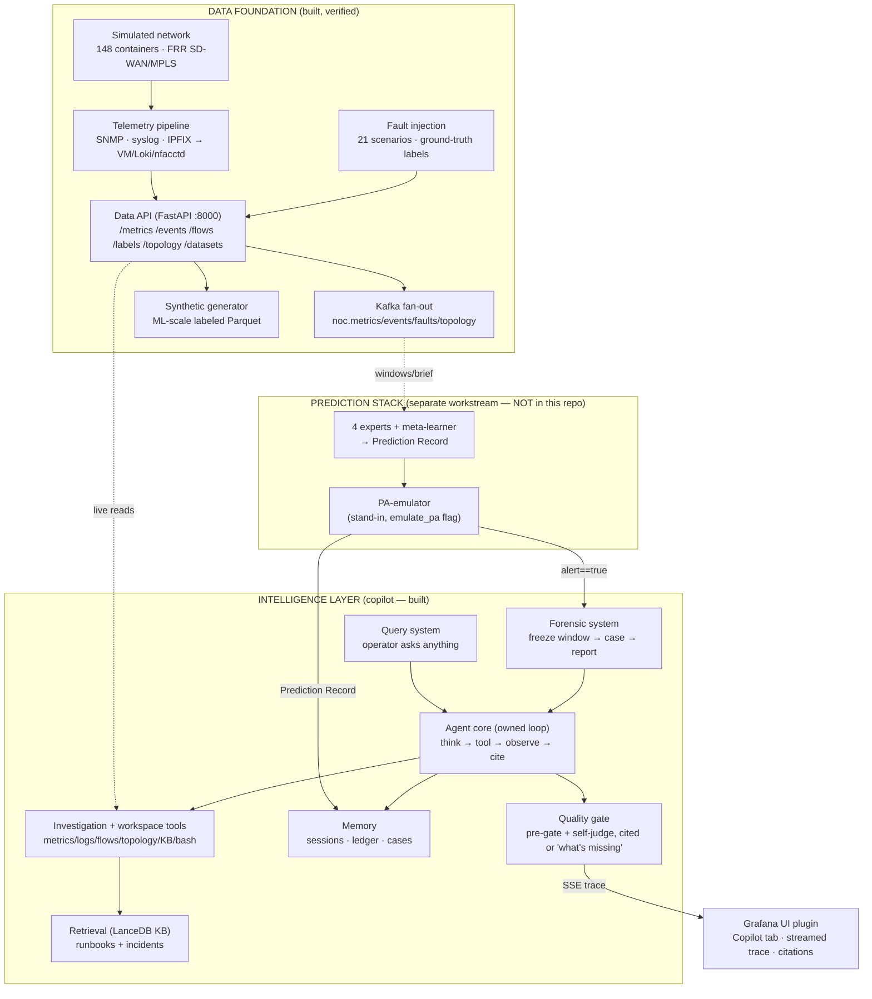

# 00 — Project Overview

**Air-Gapped Predictive NOC Copilot — ISRO BAH 2026**

> **Document set.** This overview is the map. The rest drill in:
> [01 Simulation](01_SIMULATION.md) ·
> [02 Dataset Generation](02_DATASET_GENERATION.md) ·
> [07 Copilot Architecture](07_COPILOT_ARCHITECTURE.md) ·
> [08 Integrated System](08_INTEGRATED_SYSTEM.md) ·
> [09 Deployment & Demo](09_DEPLOYMENT_AND_DEMO.md) ·
> [10 Future Prospects](10_FUTURE_PROSPECTS.md)
>

---

## 1. What the system is

The system is an **autonomous assistant for a Network Operations Center (NOC) that runs fully
offline**. It watches a large enterprise SD-WAN-over-MPLS network (SD-WAN: software-defined WAN,
a way to route traffic over multiple links; MPLS: Multiprotocol Label Switching, a way carriers
route traffic by label instead of IP lookup). It spots the early signs of a failure before users
feel it, and when it predicts a failure, it investigates on its own and writes a cited,
human-readable root-cause report. An operator can also ask it questions about the network in plain
language at any time.

Two constraints shape every design decision:

- **Predictive, not reactive.** Traditional NOC tools fire alarms *after* a threshold is
  crossed — by then calls are dropping and VPNs are timing out. This system targets the window
  before that: the minutes of quiet telemetry drift that come before visible impact. The measure
  of value is **lead time** — how many seconds of warning the operator gets.
- **Air-gapped.** The target deployment is a classified/defense network with no path to the
  public internet. Every part — models, inference runtime, vector store, telemetry databases —
  must run on operator-controlled hardware with zero outbound connections. Air-gap compliance is
  graded (20% of the competition score) and checked by an automated test that verifies nothing
  leaves the network.

Since there is no real classified network to watch, **producing realistic telemetry is itself
part of the build.** So the project includes a faithful simulated network that generates labeled
ground-truth data, plus the intelligence layer that reads it.

---

## 2. The system in one diagram

The system splits into a **Data Foundation** (generates and serves realistic labeled telemetry)
and an **Intelligence Layer** (investigates and explains). The **Prediction Stack** — a separate
team's workstream, out of scope here — sits between them. Where it's missing, a full-fidelity
**PA-emulator** stands in behind a flag.

The **only connection point** between the copilot and the prediction stack is a single JSON
object, the **Prediction Record**. Nothing in the copilot depends on the prediction stack's
internals — swapping the emulator for the real stack is a one-flag change.

---

## 3. Subsystem inventory

| Subsystem | Directory | Role | State |
|---|---|---|---|
| **Topology generator** | `generator/` | Builds the whole lab (configs + `clab.yml`) from one spec | Built, live-verified |
| **Node image** | `frr-node/` | FRR 10.5.1 + snmpd + pmacctd + WireGuard container | Built |
| **Simulated network** | `topology/` | 148-container SD-WAN-over-MPLS lab | Built, live-verified |
| **SD-WAN controller** | `controller/` | Per-tunnel path selection + telemetry (modelled RTT) | Built |
| **Traffic generator** | `trafficgen/` | Traffic that rises and falls through the day, per VRF (VRF: Virtual Routing and Forwarding, a separate routing table per customer/service), so counters move | Built |
| **Fault injection** | `faults/` | 21 reversible scenarios + ground-truth label timeline | Built, live-verified |
| **Telemetry pipeline** | `telemetry/` | 11 services: SNMP/syslog/IPFIX → VM/Loki/nfacctd + Grafana | Built, live-verified |
| **Data API** | `dataapi/` | FastAPI contract; joins all signals into a 59-column Parquet file | Built, live-verified |
| **Streaming layer** | `streaming/` | Kafka fan-out to two independent consumer groups | Built (replay-verified) |
| **Synthetic generator** | `synthetic/` | ML-scale labeled data calibrated to real captures | Built |
| **Air-gap packaging** | `airgap/` | Offline image save/load + zero-egress checker | Built, verified |
| **Copilot agent core** | `copilot/agent/` | The owned think→tool→cite loop (not a framework) | Built |
| **Investigation tools** | `copilot/tools/`, `copilot/adapter/` | Read-only tools over the Data API | Built, live-verified |
| **Retrieval / KB** | `copilot/retrieval/` | Embedded LanceDB (a vector database) over runbooks + incidents | Built |
| **Memory** | `copilot/memory/` | Session store · event ledger · (case archive) | Built |
| **Workspace (Milestone B)** | `copilot/workspace/` | Sandboxed read/write/edit/bash + artifact present | Partially built |
| **PA-emulator** | `copilot/emulator/` | Full-fidelity Prediction Record stand-in | Built |
| **Forensic system** | `copilot/forensic/` | Trigger → freeze → case → report → follow-up chat | Built |
| **UI plugin** | `grafana ui/` | Grafana Copilot tab wired to real `/chat` (SSE trace) | Built |

---

## 4. What is built vs. what is future

The project is built in deliberate stages. The Data Foundation is complete and verified against
live deployments. The copilot is largely built and has answered real questions end-to-end. The
production prediction stack and the fully-offline LLM deployment are still future work.

**Built and verified**
- The full 148-container network, deployed and checked live (OSPF/LDP/BGP/WireGuard all up).
- End-to-end telemetry, fault injection with ground-truth labels, and the Data API contract.
- The 59-column labeled Parquet dataset (schema locked) plus committed reference datasets.
- The copilot agent core, investigation tools (calling the real Data API), retrieval, memory, the
  quality gate, the PA-emulator, and the forensic case chain.
- An end-to-end run (`copilot/e2e/`) that drives real questions through the whole copilot against
  a live Data API and a real LLM, producing cited answers and correct clarifying questions.
- The Grafana Copilot tab, wired to the real `/chat` service with a streamed, citation-linked trace.

**Future work (not built here)**
- **The production prediction stack** — the experts + meta-learner that emit real Prediction
  Records. A separate workstream owns this; the copilot uses the emulator in its place today.
- **Fully-offline LLM deployment.** The end-to-end run used a network-hosted model. The local
  offline profile (`unsloth-local`) exists as a configured path, but an air-gapped end-to-end LLM
  run has not been demonstrated yet. *(The data/telemetry stack's air-gap is verified on its own.)*
- **Milestone B (coding agent)** is partially landed — the sandboxed workspace, executor, and
  artifact tools exist; wider use is future work.
- Other known open items are tracked in [10 Future Prospects](10_FUTURE_PROSPECTS.md).

Every document in this folder is clear about what is built versus what is planned. No planned
capability is presented as already working.

---

## 5. Key figures at a glance

| Figure | Value | Source |
|---|---|---|
| Lab containers | 148 (70 FRR + 78 hosts); ~159 with telemetry/infra | `generator/generate.py`, `topology-spec.yaml` |
| Provider core | 24 P (6 POPs × 4) + 12 PE, multi-area OSPF | `docs/01_PROJECT_OVERVIEW.md` §4 |
| Customer edge | 34 CE (24 branch / 6 hub / 4 dc) | `topology-spec.yaml` |
| SD-WAN overlay | 168 spoke-hub + 3 hub-hub WireGuard tunnels | `controller/` |
| VRFs | CORP / VOICE / GUEST | generator |
| Fault scenarios | 21 named, reversible | `faults/orchestrator.py` |
| Telemetry services | 11 (Docker Compose) | `telemetry/docker-compose.yml` |
| Dataset schema | 59 columns, locked; row key `(stream, topology_id, device, entity, ts)` | `dataapi/export.py`, `dataapi/schema/` |
| Copilot↔PA seam | one JSON Prediction Record | `docs/adr/0003`, `CONTEXT.md` |
| Host | 19 cores / 108 GB RAM / 1007 GB disk | `HANDOFF.md` |

---

**Next:** [01 — Simulation](01_SIMULATION.md), the simulated network that produces the telemetry.
