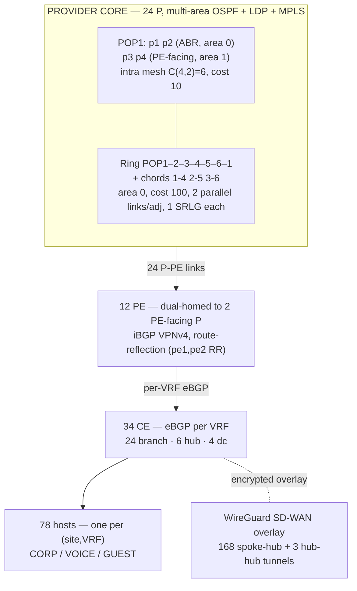

# 01 — Simulation

**The simulated network that produces the telemetry.**

← [00 Project Overview](00_PROJECT_OVERVIEW.md) · → [02 Dataset Generation](02_DATASET_GENERATION.md)

---

## 1. Why simulate

There's no classified network we can access and observe, so **we build the network instead of fetching one.**
The lab is the data source: an enterprise SD-WAN-over-MPLS (a private routed core, MPLS = Multi-Protocol Label Switching, that carries traffic between sites) network that runs
real routing protocols and sends out the same telemetry a real NOC (Network Operations Center) would collect. Realism matters here — the predictive models we build later are only as good as the
warning signs the lab actually produces.

The key design choice that makes this manageable: **one small spec file generates the whole
lab.** `topology-spec.yaml` holds only the knobs (router counts, POP structure, ASNs, VRFs,
address ranges); every IP address, BGP neighbor, OSPF area, and MPLS label gets worked out
by `generator/generate.py`. To make the lab bigger, you just change one number, and the whole topology can be rebuilt from the spec every time.

---

## 2. Topology at a glance

A three-tier enterprise network sitting on top of a provider MPLS core: **148 containers** total
(`topology-spec.yaml:36-37`).

| Tier | Count | Composition | Cite |
|---|---|---|---|
| **Provider core (P)** | 24 | 6 POPs × 4 P-routers; multi-area OSPF | `topology-spec.yaml:14-17` |
| **Provider edge (PE)** | 12 | 2 per POP, dual-homed | `topology-spec.yaml:15` |
| **Customer edge (CE)** | 34 | 24 branch + 6 hub + 4 dc | `topology-spec.yaml:24-27` |
| **Hosts** | 78 | one container per (site, VRF) | `topology-spec.yaml:33-35` |
| **Total** | **148** | + ~9 telemetry/infra ⇒ ~157 running | `generator/README.md:31-34` |

The generator builds a Containerlab config file `clab.yml` with 148 nodes (kind `linux`, image `frr-node:0.1`,
pull-policy `Never`) and **234 links** = 78 core + 78 CE-PE + 78 host (`generate.py:677-681`).



---

## 3. Provider core — real carrier-grade behavior

We built the core to fail the way a real MPLS backbone fails, not like a toy mesh.

| Mechanism | Detail | Cite |
|---|---|---|
| **Intra-POP mesh** | C(4,2)=6 links per POP × 6 = 36 links, OSPF area 1–6, cost 10 | `generate.py:210-217`, `README.md:64` |
| **Area border** | first 2 P per POP are ABRs (area 0 + local); ABR–ABR link forced to area 0 | `generate.py:216`, `topology-spec.yaml:66-67` |
| **Inter-POP backbone** | ring(6) + 3 chords = 9 adjacencies, area 0, cost 100 | `generate.py:221-231` |
| **Redundancy + SRLG** | each inter-POP adjacency = 2 parallel links sharing 1 SRLG conduit ⇒ 18 links, 9 conduits | `generate.py:224-231`, `topology-meta.json` |
| **BFD** | 300 ms rx/tx, detect-mult 3, on all P+PE OSPF links | `frr.conf.j2:22-30,39-40` |
| **Core links total** | 36 intra + 18 inter + 24 P-PE = **78** | `README.md:69` |

**Why this matters (real traffic-engineering behavior, without RSVP-TE):** the 10/100 intra/inter cost split makes traffic prefer intra-POP paths and spreads load predictably across the chord links; multi-area OSPF (Open Shortest Path First, a routing protocol) keeps route recalculation confined to the POP that's actually broken; and because the two parallel links on an inter-POP adjacency share one SRLG (Shared Risk Link Group — links that can fail together, e.g. the same physical fibre) conduit, a single fibre cut takes down both links at once. These are exactly the conditions the fault scenarios (doc 02)
use.

**iBGP — route reflection.** PE routers run MP-BGP VPNv4 (a BGP extension that carries per-customer VPN routes) over loopbacks. pe1 and pe2 act as route
reflectors; pe3–pe12 are clients that peer only with those two reflectors (`generate.py:279-288`). This gives us
**21 iBGP sessions** (10 clients × 2 RR peers + the pe1↔pe2 session) instead of the
C(12,2)=66-session full mesh a naive setup would need (`topology-spec.yaml:31`). Route Distinguishers (a tag that keeps identical customer IP ranges apart across VPNs) are set **per (PE, VRF)**
(`<pe_loopback>:<rt_field>`), not shared, so identical customer prefixes from different customers don't collide as
VPNv4 routes (`generate.py:403`, `frr.conf.j2:120`).

---

## 4. MPLS L3VPN, VRFs, and QoS

**Transport.** OSPF maps the core, LDP (Label Distribution Protocol) hands out labels on all P-P and P-PE links
(using loopback addresses), and PE-PE MP-BGP VPNv4 carries the customer routes
(`topology-spec.yaml:52-62`, `frr.conf.j2:78-103`). There is **no `vrflite` fallback mode** — MPLS/
LDP is always on (`topology-spec.yaml:52-53`).

**Three VRFs** (Virtual Routing and Forwarding instances — separate routing tables that keep traffic types apart) keep traffic classes isolated end to end:

| VRF | Table / RT | DSCP (label) | QoS prio | bw% / burst% | Sites | Cite |
|---|---|---|---|---|---|---|
| **CORP** | 10 / 65000:10 | AF31 | 2 | 50 / 20 | all | `topology-spec.yaml:72-75,183-184` |
| **VOICE** | 20 / 65000:20 | EF (highest) | 1 | 30 / 10 | all | `topology-spec.yaml:77-80,179-181` |
| **GUEST** | 30 / 65000:30 | BE (lowest) | 3 | 20 / 5 | hub, dc only | `topology-spec.yaml:82-85,185-187` |

QoS (Quality of Service, traffic prioritization) runs as HTB (Hierarchical Token Bucket, a Linux traffic-shaping tool) on the CE egress uplink (root 1 gbit; class rate = bw%×root, ceiling = (bw+burst)%×root),
with an `fq_codel` leaf queue underneath (`qos.sh.j2`, `generate.py:691-697`).

> **Honest limitation.** DSCP values are labels only — nothing actually **marks or matches on DSCP**
> anywhere; each uplink carries just one VRF, so HTB shaping happens per uplink, not per
> DSCP class (`topology-spec.yaml:172-190`, `qos.sh.j2:2-4`). Priority ordering comes
> from the bandwidth split, not from packet marking.

---

## 5. WireGuard SD-WAN overlay

On top of the MPLS underlay runs a WireGuard **hub-spoke** overlay (VPN tunnels with no direct spoke-to-spoke shortcuts,
`topology-spec.yaml:160-165`):

- 6 hub CEs act as concentrators (`172.16.0.1–.6`); each of the 28 spokes (24 branch + 4 dc) tunnels
  to **all 6 hubs**, giving **168 spoke-hub tunnels** (`controller/topo.py:44-45`, `generate.py:474-486`).
- Adjacent hub pairs also peer directly, adding **3 hub-hub tunnels**, for 171 total (`generate.py:488-498`).
- Keys are generated inside the node image and cached; tunnels run over userspace `wireguard-go`
  (`generate.py:82-99,568-569`); a 25 s keepalive keeps them up (`wg0.conf.j2:16`).

This two-layer underlay+overlay design is the standard shape of modern enterprise SD-WAN, and how
underlay failures show up as overlay degradation is where the richest predictive signals live.

---

## 6. The SD-WAN controller — and what is real vs. modelled

A Python controller (`controller/controller.py`, exposing Prometheus metrics on :9362, checking every 5 s) picks which
tunnel each traffic class uses and reports per-tunnel telemetry. Path score = `loss_pct×10 +
latency_ms`; it switches paths when loss is ≥5% or latency is ≥3× the baseline **and** another tunnel is at least 15% better
(`controller.py:481-493`).

**This is the one part of the system where being honest about what's real matters most.** The `sdwan_tunnel_*`
metrics are **simulated**, and the Prometheus HELP text says so directly (`controller.py:556-578`). Here's how the number is built:

```
target_latency = measured_wg0_rtt          # REAL: ping -I wg0
               + queue_ms                    # MODELLED: M/M/1, queue_mult·9·ρ/(1-ρ)
               + netem_delay                 # READ BACK from the qdisc CONFIG, not measured
               + gauss(0, 0.4)               # RNG jitter
```
(`controller.py:294,327`; ρ = per-VRF utilization × week-scale, capped 0.985, `controller.py:255-256`.)

| Signal | Status | Cite |
|---|---|---|
| Routing protocols (OSPF/LDP/MP-BGP/eBGP) | **REAL** — FRR 10.5.1 | `frr-node/Dockerfile:1`, `frr.conf.j2` |
| SNMP interface counters (IF-MIB) | **REAL** — net-snmp `snmpd`, polled by Telegraf | `Dockerfile:6-11`, `start.sh:48-54` |
| Traffic bytes (`nc` backend) | **REAL** dataplane bytes across MPLS + WG | `trafficgen.py:249-256` |
| IPFIX flow records | **REAL** — pmacctd → nfacctd | `Dockerfile:19`, `start.sh:56-59` |
| wg0 RTT + loss | **MEASURED** — `ping -I wg0` via `docker exec` | `controller.py:16-24,160-196` |
| Queue / jitter / loss-burst | **MODELLED** — M/M/1, AR(1), RNG | `controller.py:289-324` |
| Injected-fault term | **READ BACK from netem qdisc config** — the wg0 ping doesn't actually cross the faulted `eth1` link | `controller.py:11-14,258-261` |
| All `sdwan_tunnel_*` series | **SIMULATED** (declared in HELP text) | `controller.py:556-578` |

Bottom line: the **control plane and the packet/flow/SNMP telemetry are genuinely real**; the
**per-tunnel latency/jitter/loss numbers are a calibrated model** whose fault component comes from
the injector's own config, not from something measured on the wire. Replacing that modelled term with a
true measurement means routing the WireGuard endpoint over the L3VPN — a known open item
(doc 10).

---

## 7. Traffic generation

`trafficgen/trafficgen.py` drives traffic for each VRF on a daily cycle so counters and flows actually move,
using a deterministic seed (`blake2b(site|vrf|tick_bucket)`) so runs are repeatable
(`trafficgen.py:113-115`):

| VRF | max flows | bytes/flow | proto | burstiness | Cite |
|---|---|---|---|---|---|
| VOICE | 60 | 18 KB | udp | 0.08 (steady) | `trafficgen.py:75` |
| CORP | 22 | 900 KB | tcp | 0.65 (bursty) | `trafficgen.py:76` |
| GUEST | 7 | 6 MB | tcp | 0.90 (spiky) | `trafficgen.py:77` |

Traffic follows a daily curve with a peak at least 4× the trough (`trafficgen.py:100-120,430`);
the default `nc` backend sends real bytes end to end (`iperf3`/`sim` are lighter-weight alternatives).

---

## 8. Node image and boot order

The `frr-node:0.1` image is `quay.io/frrouting/frr:10.5.1` plus net-snmp, pmacct, iproute2,
wireguard-tools/-go, iptables, and rsyslog (`frr-node/Dockerfile`). It boots in this order
(`frr-node/start.sh:8-64`): MPLS sysctls (best-effort) → rsyslogd → snmpd → pmacctd → FRR
(runs in the foreground).

Two honest caveats are baked into the image:

- **MPLS dataplane is best-effort.** The sysctls run with `2>/dev/null || true` because they may be
  blocked in unprivileged containers (`start.sh:37-38`). On the WSL2 host the MPLS *dataplane* isn't
  guaranteed to work, but the routing *control plane* (labels in the FRR RIB/LFIB) is real either way, and
  that's what the telemetry and models actually use.
- **FRR SNMP AgentX is disabled.** The Alpine `frr-snmp` package doesn't match FRR 10.5.1's ABI,
  so the FRR sub-agent isn't shipped and `frr.conf` has no `agentx` line; Telegraf instead polls the
  standard IF-MIB straight from `snmpd` — the same interface counters a real NOC would poll, just
  not through an FRR routing-table sub-agent (`Dockerfile:5-11`, `start.sh:49-54`).

---

## 9. Generation flow (single spec → whole lab)

```
topology-spec.yaml ──► generate.py ──► build model (derive every address from node indices)
                                   │
                                   ├─► check (pre-render: IP/LAN collisions, iBGP count, wg peers)
                                   ├─► render 8 Jinja2 templates per node
                                   │     frr.conf · daemons · 90-mpls.conf · snmpd.conf
                                   │     qos.sh · vtysh.conf · wg0.conf · clab.yml
                                   ├─► emit topology/clab.yml (148 nodes, 234 links)
                                   ├─► emit topology-meta.json (POPs, ABRs, SRLGs, P-PE map)
                                   │     └─ consumed by faults/orchestrator + dataapi
                                   ├─► emit device_map.txt per FRR node (nfacctd pre_tag_map)
                                   └─► check (post: files present, device_map count)
```
(`generate.py:588-595,677-729,736-848`; `--check` guards addressing.)

`topology-meta.json` is the shared file that lets the fault system pick real targets (which P router is an ABR,
which links share an SRLG) and lets the Data API describe the network graph — one generated source of
truth, not a hand-maintained copy.

---

## 10. What this subsystem is and is not

**Is:** a real FRR routing fabric (OSPF/LDP/MP-BGP/eBGP), real SNMP/flow/packet telemetry, a real
WireGuard overlay, all rebuildable from one spec file.

**Is not:** a fully-instrumented dataplane. The per-tunnel SD-WAN latency/jitter/loss numbers are a
calibrated model (with a measured RTT floor); DSCP is a label, not an enforced marking; the MPLS
forwarding plane is best-effort on WSL2; three interface error counters are always zero in
containers and only apply to real hardware (see doc 02). None of this is presented as measured
where it's actually modelled — the Prometheus HELP text and the tables above flag every case.

**Next:** [02 — Dataset Generation](02_DATASET_GENERATION.md), how faults, labels, and the
synthetic generator turn this network into ML-ready ground truth.
