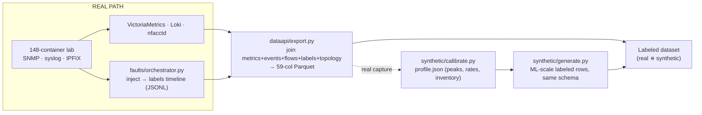

# 02 — Dataset Generation

**Turning the simulated network into ML-ready labeled ground truth.**

← [01 Simulation](01_SIMULATION.md) · → [07 Copilot Architecture](07_COPILOT_ARCHITECTURE.md)

---

## 1. The problem this subsystem solves

A predictive model needs supervised examples: telemetry windows tagged with *what was failing*
and *how long until impact*. The lab (doc 01) sends out raw signals; this subsystem builds the
**labels** and joins everything into one documented, ML-ready table.

Two sources feed **one shared 59-column schema (the table's fixed column layout)**:

- **Real captures** — the live lab runs, faults get injected on a schedule, and every signal is
  joined against the ground-truth label timeline.
- **Synthetic augmentation** — a generator tuned to match the real captures produces ML-scale
  labeled data (millions of rows) in the same schema, so the two sets stack together directly.

---

## 2. Fault injection — the supervision signal

`faults/orchestrator.py` injects faults and writes a **ground-truth label timeline** (JSONL, a
text file with one JSON object per line, `orchestrator.py:49`). This timeline is the join key for
every label the models learn from.

**21 scenarios** (`SCENARIOS`, `orchestrator.py:594-617`) = 4 mandated + 3 adversarial + 5 extended
+ 9 core/catastrophic/correlated (`faults/README.md:123-131`):

| Class | Scenarios |
|---|---|
| **Mandated (4)** | `congestion`, `bgp_flap`, `tunnel_degrade`, `policy_drift` |
| **Adversarial (3)** | `node_failure`, `asymmetric_loss`, `brownout` |
| **Extended (5)** | `mpls_underlay_failure`, `ldp_session_flap`, `hub_spoke_congest`, `bgp_cascade`, `controller_drift` |
| **Core / catastrophic / correlated (9)** | `p_node_failure`, `pop_isolation`, `core_partition`, `srlg_cut`, `core_congestion`, `ospf_area_flap`, `path_asymmetry`, `rr_failure`, `gray_failure` |

Every fault is a reversible building block in `faults/injectors.py`, each with an `apply()` step
and an idempotent (safe-to-repeat) `revert()` step: `NetemImpair` (delay/jitter/loss/rate ramp),
`LinkFlap`, `BgpFlap` (`vtysh clear bgp`), `ProcessKill` (`kill -9 bgpd`, watchfrr brings it back),
`WgRekeyAnomaly`, `PolicyDrift` (VRF — a virtual routing table that keeps traffic separated — route-map
local-pref), `MultiLinkFault` (interface-set down, read from `topology-meta.json` — drives
`p_node_failure`/`pop_isolation`/`core_partition`/`srlg_cut`), `OspfCostShift`.

**Two run modes:** one named scenario, or `--campaign` — faults arrive on a Poisson schedule
(random but with a fixed average gap; `expovariate(1/mean_gap)`, default gap 120 s), one thread per
fault, up to 3 at once (`orchestrator.py:862-863,1106`). `pop_isolation` and `core_partition` are
left out of the random campaign (named tests only — they split the network in two,
`orchestrator.py:905-906`). A lock per `(device, resource)` pair stops two faults from colliding;
`resource=None` reserves the whole device for one fault (`orchestrator.py:964-967`).

### The label record and its timestamps

Each label (`_label_row`, `orchestrator.py:675-694`) carries `scenario_id`, `type`, `target`,
`severity` (low/medium/high, null for faults with no measurable impact), `t_start`, `t_impact`,
`t_end`, `lead_time`, `impact_method`, `device`, `signature`, and probe values. The main prediction
target comes from two timestamps:

- **`t_start`** — when the fault is injected.
- **`t_impact`** — when telemetry first crosses the per-VRF SLA (service-level threshold).
- **`lead_time = round(t_impact − t_start, 1)`** — the seconds of warning a model could use.

**`impact_method`** records *how* `t_impact` was worked out — this matters for trusting a label
(`_resolve_impact`, `orchestrator.py:635-671`):

| Method | Meaning |
|---|---|
| `vm_threshold` | A live probe (polled every 3 s) crossed the baseline — a *measured* impact |
| `ramp_derived` | No probe crossing, but the scenario ramped up → `t_impact` = the SLA crossing point inside that ramp |
| `modelled_fallback` | Probe was read but never crossed the line during the run → `t_impact = t_start` |
| `probe_unavailable` | Probe returned nothing the whole window (VictoriaMetrics missing/error) |
| `modelled` | No probe and no ramp → `t_start + impact_delay_s` |

### Lead time is drawn from priors, not clamped

A prior audit found `lead_time_s` was basically a constant (CV — coefficient of variation, a
spread measure — of 0.03, only 9 distinct values). It now comes from `faults/leadpriors.py`:
per-fault-type lognormal (log-normal distribution) priors bucketed by mechanism (control-plane
4–10 s, congestion 10–40 s, overlay/policy 8–30 s, underlay 6–20 s, gray_failure 20–80 s), with the
10th/90th percentile pinned to each bucket's endpoints (`leadpriors.py:26-55,95-107`). SLA
thresholds are set per VRF (VOICE 150 ms/1%, CORP 250 ms/2%, GUEST 400 ms/5%; VOICE is the
tightest, `leadpriors.py:64-81`). `faults/signatures.py` holds the one shared fault-to-signature
peak/ramp table used by both the generator and the (future) live controller, so the two can't drift
apart.

---

## 3. The join and the canonical schema

`dataapi/export.py` joins all signals into the **59-column** Parquet (a columnar file format built
for fast analytics; `COLUMNS`, `export.py:55-100`). The first 21 columns are the original frozen
order; the rest were added across device-health, multi-label, and dataset-diversity passes.

| Group | Columns (representative) |
|---|---|
| Keys + metrics | `ts`, `device`, `site_type`, `vrf`, `entity`, `entity_type`, `if_*_octets`, `tunnel_latency/jitter/loss`, `flow_bytes/packets` |
| Fault (primary) | `is_fault`, `scenario_id`, `fault_type`, `severity`, `lead_time_s`, `time_to_impact_s` |
| Interface-scoped | `if_in_errors`, `if_in_discards`, `if_out_errors`, `if_out_discards`, `q_backlog_bytes`, `q_drops`, `xcvr_*` |
| Device-scoped | `cpu_pct`, `mem_pct`, `bgp_msg_rx/tx`, `rib_routes`, `ospf_lsa_count`, `device_temp_c`, … |
| Concurrency (multi-label) | `fault_types`, `severities`, `scenario_ids`, `impact_methods`, `n_concurrent` |
| Diversity supervision | `topology_id`, `stream`, `is_hard_negative`, `is_root`, `cascade_parent_id`, `cascade_depth`, `cascade_motif_id`, `affected_entity_count`, `injection_seed` |

**How the join works** (`export.py:178-438`): one row per `(device, entity, entity_type,
ts-bucket)`, aligned to UTC time steps. Labels are LEFT-joined wherever the bucket `[ts, ts+step)`
overlaps `[t_start, t_end]` on that device; a fault scoped to one entity narrows to just its
interface. Every overlapping episode is stored as index-aligned **list columns**, with the
highest-severity fault at index 0 (up to 3 at once). Flows attach only to the device row (this
avoids roughly 15x row inflation).

- **Row key:** `(stream, topology_id, device, entity, ts)` (`DATASETS.md:119-122`).
- **Picking precursor rows:** use `export.precursor_mask(df)` — `time_to_impact_s` is a list, so
  comparing it to a plain `> 0` is wrong (`export.py:459-467`).
- **Companion tables** ship next to the main Parquet: `*_events` (control-plane events at exact
  sub-bucket timestamps), `*_topology_edges` (the network graph, interval-encoded), `*_paths`
  (ordered hop sequences, `wg_tunnel` / `ospf_spf_path` only — this host has no MPLS dataplane, the
  actual packet-forwarding layer).

The schema is published as a JSON Schema file (a machine-readable contract for the data's shape;
`dataapi/schema/dataset.schema.json`, Draft 2020-12; required fields = `ts, device, entity,
entity_type, is_fault`). The `/datasets` endpoint returns this Parquet directly, so the ML team
doesn't need to write its own join logic or PromQL (Prometheus's query language) queries.

---

## 4. Synthetic augmentation

A few hours from a 148-container lab isn't enough data at ML scale, so `synthetic/generate.py`
extends the real captures — it's calibrated to match them, not invented from scratch.

**Calibrate → generate.** `synthetic/calibrate.py` derives `profile.json` from a real capture:
per-site octet rates, tunnel latency/jitter/loss baselines, fault-signature *peaks* (from
`signatures.default_signatures`), device-health ranges, and device inventory
(`calibrate.py:38-241`). Each field records where it came from — `_src: real | default`. Note that
`lead_s` is **not** pulled from the capture (it's kept only as a hint) — lead times come from the
priors described above instead.

**Scale.** Row count = `entities_per_tick × ticks`, and grows linearly with `--days`; `--scale`
only changes how dense the fault episodes are (`README.md:96-99`). At the current **899
entities/tick** (661 interface + 168 tunnel + 70 device), `--days 7 --scale 3` produces about
**18.1 M rows**. Defaults: `--days 2`, `--step 30`, `--scale 1`, `--seed 42`.

**Diversity and realism controls:**

| Control | What it does | Cite |
|---|---|---|
| 12 topologies | 10 for training + 2 held out → lets you evaluate on a topology the model never saw | `topologies.py:282-283` |
| Stream F / N | F = fault-dense (campaign); N = fault-free plus hard negatives; the sampler mixes them by prevalence | `generate.py:816-817` |
| Hard negatives | rows that *look* like faults but aren't (`is_fault` stays False) | `generate.py:720-816` |
| Cascades | 20% of episodes seed a depth-2–3 chain that spreads across the graph (`is_root`/`cascade_*`) | `generate.py:825-861` |
| `injection_seed` | a per-fault random-number draw → lets you reproduce one scenario inside the air gap | `generate.py:802` |

**`synthetic/check.py`** enforces 9 gates a file must pass before it can ship — including that its
metadata carries `synthetic=true` + `seed` + `calibrated_from` (a file with no attribution is
rejected), that columns match `COLUMNS`, that lead-time CV is at least 0.50, that the three dead
error counters are 0, and that faults with no measurable severity have a null severity value
(`check.py:58-294`).

---

## 5. The reference datasets

Three Parquet files are committed (`DATASETS.md`), all in the 59-column schema and safe to
concatenate together:

| Dataset | Rows | Source | Episodes | Fault rows | Scope |
|---|---|---|---|---|---|
| **Real** | 49,844 | live lab, 24.5-min capture | — | 391 | 17 scenario_ids, 10 fault types |
| **Synthetic train** | 2,589,120 | `generate.py` seed 42 | 719 | 159,021 (124,108 precursor) | all 21 types |
| **Synthetic holdout** | 2,589,120 | seed 7 | 720 | 156,054 (122,627 precursor) | all 21 types |

Row math: 899 keys/bucket × 2,880 buckets = 2,589,120. Train and holdout share **zero
scenario_ids** — the split is by episode, not by time of day (`DATASETS.md:56-64`). Lead-time CV:
real 1.30, train 0.83, holdout 1.03.

---

## 6. Data quality — fixed defects and honest limits

**Six audited defects were fixed** (`docs/SPEC-NOTES.md:716-745`, checked by
`synthetic/verify_fixes.py`, 24 checks):

| Defect | Fix |
|---|---|
| `lead_time_s` clamped (CV 0.03) | per-type priors → CV ≥ 0.50 |
| error counters worked as a synthetic-row detector | three counters forced to 0 |
| `vrf` 100% null | populated (interface name / tunnel set) |
| flows null | modelled fallback |
| single-winner collapse | multi-label list columns, ≥2 concurrent |
| `severity` string, `ts` ISO string | ordinal float 0.33/0.66/1.0; `timestamp[us,UTC]` |

**Three interface error counters (`if_in_errors`, `if_in_discards`, `if_out_errors`) are
deliberately kept at 0.** Container veth pairs never raise CRC/input errors, so emitting nonzero
values here would have made `if_in_errors > 0` a giveaway that a row is synthetic. The underlying
OIDs (SNMP object identifiers) are polled correctly and *will* populate on real hardware — this is
the literature's top-ranked failure signal, and it's held back for deployment rather than faked in
this lab (`DATASETS.md:73-81`). By contrast, `if_out_discards`, `q_drops`, and `q_backlog_bytes`
are genuinely measured via `tc -s qdisc`.

> **Open realism gap (checked, and stated plainly).** A discriminator model (HistGradientBoosting)
> trained to tell real rows from synthetic ones scores **AUC = 0.9999** — near perfect, meaning the
> synthetic distribution would not transfer to the real one as-is (`SPEC-NOTES.md:1263-1308`). The
> cause is *not* a flaw in the synthetic generator but a gap in the **real capture** itself: during
> that 24-minute run the VPNv4 dataplane was down (the host kernel is missing `CONFIG_LWTUNNEL`, so
> MPLS label imposition fails), leaving forwarding partial and some fields stuck at
> default-calibrated values. The real fix is a clean capture of 7+ hours and a recalibration
> (item G5), tracked in [10 Future Prospects](10_FUTURE_PROSPECTS.md). The control plane
> (OSPF/LDP) in that capture was real; the chassis/optical columns are modelled
> (`telemetry/envmodel.py`).

---

**Next:** [07 — Copilot Architecture](07_COPILOT_ARCHITECTURE.md), the LLM-facing agent that
consumes this data to investigate and explain.
