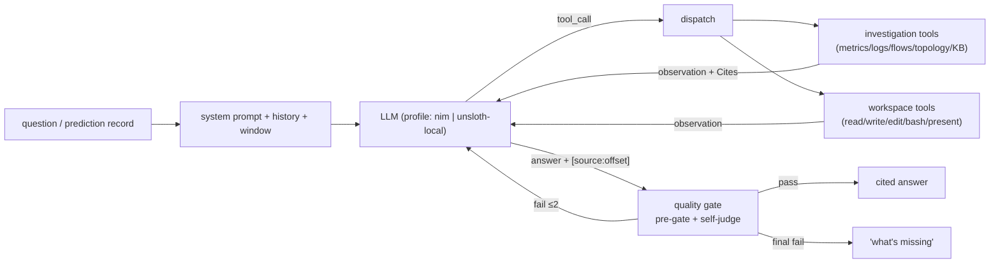

# 07 — Copilot Architecture

**The LLM-facing agent that investigates the network and explains itself.**

← [02 Dataset Generation](02_DATASET_GENERATION.md) · → [08 Integrated System](08_INTEGRATED_SYSTEM.md)

---

## 1. Design stance

The copilot is not a chatbot bolted onto a dashboard. It is a small **agent loop** (a program that
repeats think → act → check until it has an answer) that we own and control — no third-party agent
framework (ADR-0005, `copilot/agent/loop.py:1-8`). The loop runs:
`think → pick a tool → run it → observe → decide → cited answer`.
Three principles shape every part of it:

- **Two systems, one core.** A **Forensic** system (starts itself when a fault is predicted) and a
  **Query** system (a human asks a question) run the *same* loop. They only differ in who starts
  them and what data window they see (§8).
- **Evidence or nothing.** Every claim in an answer must point to something a tool actually
  observed. A two-stage quality gate (a check the answer must pass before it reaches the user)
  blocks answers that claim more than the evidence supports. When it can't pass, it says *what's
  missing* instead of guessing (§6).
- **Air-gap-clean seams.** The LLM, the embedder (turns text into vectors for search — see §4), and
  the data adapter can all be swapped via config, so the whole copilot can run on local offline
  models with no code change (§7). Every outside dependency is boxed into one adapter so nothing
  else depends on its exact shape.



---

## 2. The agent loop

`investigate()` (`loop.py:230-241`) is the single entry point. It requires `question` and a
`WindowContext` (the time range the loop is allowed to look at). Keyword-only args: `llm, adapter,
cfg`. Optional wiring: `retriever, kg, skills, executor, workspace, history, fault_type, abstain,
drift_state`. The file is about 525 lines — roughly 150 lines of core logic plus gate/skill/workspace
glue — and uses no framework.

| Mechanism | Behavior | Cite |
|---|---|---|
| **Event schema** | Every step emits an `Event{type, data, ts}` (7 fixed types); `ts` is stamped automatically in ISO-UTC when the event is created. `event_wire(e)` = `{type, ts, **data}`, checked to be lossless | `loop.py:45-84` |
| **Dispatch** | Uses the model's native `reply.tool_calls` if present, otherwise falls back to our own JSON parser (the whole turn must be one JSON object or a ```json fence) | `loop.py:154-175,302-304` |
| **Budgets** | `step_cap` turns (default 8), `tool_call_cap` productive calls (default 6), hard backstop of `step_cap × tool_call_cap`. Only calls that return usable evidence count against the budget; empty or errored calls are free | `loop.py:294-301,387-395` |
| **Window threading** | The loop inserts `{start, end}` into every tool call that needs a time window; the model never sets these bounds itself | `loop.py:24-27,383` |
| **Citations** | Tool calls return `Cite` structs (small records of what was observed and where); the answer must reference them as `[source:offset]` (no ranges); matched with `CITE_RE = \[[^\[\]]+\]` | `loop.py:39,178,298` |
| **Ask-back** | If a turn has no evidence and ends in `?`, it skips the gate — a clarifying question counts as a valid answer | `loop.py:308-315` |
| **History compaction** | Rule-based, no LLM involved: keeps recent turns plus one summary note that preserves every citation id | `loop.py:181-227` |

---

## 3. Tools and the data adapter

**Investigation tools** (`copilot/tools/registry.py`) are read-only and wrap the Data API. The
registry (`TOOLS`/`RETRIEVAL_TOOLS`/`TOOL_SPECS`) exposes them as native function-call schemas so
the model can call them directly:

| Tool | Backing | Notes |
|---|---|---|
| `query_metrics` | `/metrics` | ranged (time-series) allowed |
| `search_logs` | `/events` | pattern filter applied by the adapter |
| `flows` | `/flows` | window-bounded |
| `walk_topology_graph` | `/topology` | BFS `_walk`, cites `[topo:node]`, KG hint is additive-only |
| `search_runbooks` / `search_incidents` | LanceDB KB (see §4) | not windowed (KB content is historical) |

Two rules make it safe to let an LLM drive these tools:

- **Mandatory filters + caps.** Every call goes through `Filters(...)`; the time window and
  `t_snapshot` (the frozen point in time for a forensic run) ride along automatically. Ranged
  metric queries without an explicit limit fall back to `MAX_LIMIT` (`registry.py:117-131`).
- **Errors are guidance, not exceptions** (ADR-0015). An unknown tool, a bad filter, or a failed
  adapter call all come back as an `"error: …"` *observation* that the model reads and reacts to —
  the loop never crashes on a bad tool call (`registry.py:108-139`).

**The adapter** (`copilot/adapter/http.py`, `HttpAdapter`) is the only layer that knows the exact
shape of the Data API's endpoints (ADR-0006), so if an endpoint changes, only the adapter changes —
not the agent. It smooths over shape mismatches found during integration:

- **Timestamp normalization** — `/metrics` returns epoch integers, `/events` returns ISO-8601,
  `/flows` returns space-separated strings; `_iso_to_epoch` converts all of these to epoch integers
  so the gate's numeric comparisons never fail (`http.py:55-67`).
- **PromQL synthesis** — query selectors are built from `Filters` using `json.dumps` for quoting, to
  stop a selector from being broken out of (`http.py:70-79`).
- **Caps** — at most 5 series, 20 samples, 1000 fetched rows, 25 s timeout (`http.py:39-52`).
- **Fail-safe** — a transport failure becomes an `AdapterError`, which turns into a tool
  observation — not a crash, and not a false "unknown device" (`http.py:128-141`).

---

## 4. Retrieval

`copilot/retrieval/` provides the Knowledge Base of runbooks and past incidents, stored in
**embedded LanceDB** (a vector database that runs in-process — no server needed). Search is
brute-force cosine similarity, which keeps it air-gap-clean (`store.py:1-28`). Searches are
**scoped by source**: `search(query, k, source, nodes)` filters in LanceDB first (`prefilter=True`)
before running the vector search, and every result (`Hit`) carries `{id, text, source, node, ts}`
plus a score (`store.py:54-74`).

The embedder (the component that turns text into vectors for search) is chosen by config profile
(`make_embedder(cfg)`, `embedder.py:16-23`):

| Profile | Backing | Status |
|---|---|---|
| `nim` | OpenAI-compatible `/embeddings` endpoint (nv-embedqa, 1024-dim, separate handling for query vs. passage text) | **Real** |
| `unsloth-local` | local sentence-transformers, loaded on demand | **Real** |
| *(injected)* | `HashEmbedder` (md5 bag-of-tokens, 64-dim) | **Test double** — not selectable via config, used only in tests |

---

## 5. Memory — five domains

The copilot's memory is split into five domains, each with its own store (ADR-0009). This keeps
live conversation, curated knowledge, the running system timeline, and permanent postmortem records
from mixing together:

| Domain | Store | Purpose |
|---|---|---|
| **Live Observability** | VictoriaMetrics / Loki / nfacctd | raw network truth, never copied elsewhere |
| **Knowledge Base** | LanceDB + markdown in git | what the agent looks up |
| **Event Ledger** | append-only SQLite | the system's timeline |
| **Case Archive** | `cases/<id>/` immutable files | reproducible postmortems (doc 08) |
| **Session Store** | `sessions/<id>/`, resumable | working memory of conversations |

- **`SessionStore`** — stores `sessions/<id>/{events.jsonl, meta.json}`; `append` takes a
  per-conversation `flock` (so only one writer at a time); a session can resume after a process
  restart via `history(sid)`, which replays only user/assistant messages and skips trace-only
  events (`session.py:27-77`).
- **`Ledger`** — append-only SQLite keyed by record id; `INSERT OR IGNORE` makes repeated appends
  safe to retry; queryable by `by_device` / `by_time` (`ledger.py:23-58`). Prediction Records,
  journal entries, and gate outcomes all land here.

---

## 6. The quality gate

Before any answer reaches the user, it must pass a **two-stage gate** (ADR-0008):

1. **Deterministic pre-gate** (`copilot/agent/gate.py`) — three rule-based checks: did the tool
   calls succeed, is there enough evidence (at least `gate_min_evidence` citations, in-window,
   tied to the right entity, on-topic), and are the citations valid. Metrics/events/flows are
   checked against the time window; KB and topology results are exempt (`gate.py:76-146`).
2. **Self-judge** — a separate LLM call that returns `{pass, missing[], contradictions[]}`. If its
   output is malformed JSON, it fails *open* (treated as a pass) so a broken judge can't freeze the
   loop (`loop.py:405-427`).

If the gate fails, the loop retries (**agentic retry**, up to `gate_max_retries`, default 2),
going back to fetch the `missing[]` evidence. If it still can't pass after that, **`missing[]`
becomes the answer** — the system tells the operator what it couldn't confirm, instead of making
something up. A `gate` event is logged on both pass and fail (`loop.py:316-346`).

Two extra rules keep this honest under uncertainty:

- **Abstain softening** — if the prediction itself is an abstention (a "no confident call"
  result), the pre-gate's *evidence-sufficiency* bar relaxes, but the *integrity* checks
  (in-window, on-topic, valid citations) still apply, and a self-contradiction still blocks the
  answer. "Anomalous, no confident call" is allowed as a valid answer (`gate.py:82-106`,
  `loop.py:326-329`).
- **`prior_cites`** — when a forensic run synthesizes results from sub-chats, it inherits their
  evidence and passes it to the gate as first-class citations (`gate.py:135-141`).

---

## 7. Workspace (Milestone B)

Milestone B adds a coding agent on top of the same loop. It is **partially built**: the sandbox,
executor, and artifact tools exist, but broad use is planned for later, not built yet.

| Component | Role | Guarantee | Cite |
|---|---|---|---|
| `policy.py` | Path cage (restricts which files are writable) | `writable(path)` = checked via realpath containment; blocks `..`, symlink escape, and prefix-sibling tricks | `policy.py:25-52` |
| `tools.py` | read/write/edit | basic safety rules: must read before edit, write only creates new files, edit must match text exactly; errors returned as strings, not exceptions | `tools.py:41-99` |
| `executor.py` | `bash` | runs under `unshare -n` (a real kernel network namespace with no network access, not just an environment trick); has a wall-clock timeout; kills the whole process group with SIGKILL; **fails closed** if the namespace can't be set up | `executor.py:40-107` |
| `present.py` | `present` | takes a snapshot when the agent "presents" something, into an append-only `artifacts/` folder; freezes the bytes at that moment; emits an `artifact` event (chart as base64 or code text, capped at 512 KB inline) | `present.py:66-110` |

Isolation is enforced at the **tool layer, not by a container** (ADR-0013). The no-network sandbox
is verified for real — tests confirm that `connect()` fails inside it.

---

## 8. Two systems, one core

Forensic and Query are the same `investigate()` loop, just given a different `WindowContext`
(ADR-0002):

| Aspect | Query system | Forensic system |
|---|---|---|
| Who starts | human `POST /chat` | automatic, from a Prediction Record |
| Window | `WindowContext.query(start, end)` — a rolling `now−X` window or a named historical period | `WindowContext.forensic(t_snapshot)` — **frozen** at the moment of the fault |
| `frozen` | False | True |
| Adapter | live `HttpAdapter` | `ReplayAdapter` reading a frozen disk snapshot |
| Freeze guard | none | `Filters.validate` rejects any read where `end > t_snapshot` |

The loop inserts the window into every tool call; the model can never widen it. KB search is
deliberately exempt from the window, since historical knowledge is always fair game. This is why
one ~150-line core can serve both an autonomous postmortem and an interactive investigation, with
no branching logic between them.

---

## 9. What is real vs. a test double

This is real, working code. Three seams have injectable test doubles used only in tests (they are
wired in directly, never chosen through a config profile):

| Seam | Real | Double |
|---|---|---|
| LLM | `OpenAIClient` (gpt-oss-20b via `nim`, or `unsloth-local`) | `ScriptedLLM` |
| Embedder | `NimEmbedder` / `LocalEmbedder` | `HashEmbedder` |
| Adapter | `HttpAdapter` (real Data API) | `StubAdapter` / `ReplayAdapter` |

Configuration is merged in this order: `defaults ← config.yaml ← env secrets` (secrets are
rejected if someone puts them in YAML instead). This config also carries the deployment flags —
`emulate_pa`, `kg_enabled`, `llm_profile`/`embed_profile`, `ledger_to_kb`, `history_compaction` —
plus the loop budgets from §2 (`config.py:49-132`). The next doc covers the end-to-end proof that
all of this runs against real backends, and the one place air-gap isn't closed yet: the LLM.

**Next:** [08 — Integrated System](08_INTEGRATED_SYSTEM.md), how the copilot connects to the
prediction seam, the streaming layer, the forensic case chain, and the UI.
