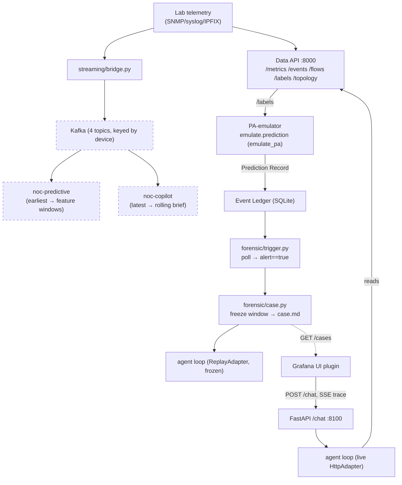

# 08 — Integrated System

**How the subsystems connect end-to-end: the prediction seam, the forensic chain, the streaming
fan-out, the chat service, and the UI.**

← [07 Copilot Architecture](07_COPILOT_ARCHITECTURE.md) · → [09 Deployment & Demo](09_DEPLOYMENT_AND_DEMO.md)

---

## 1. The integration picture

The copilot (doc 07) does not work alone. It reads predictions through one JSON connection point
(a "seam"), starts its own investigations on a poll loop, and runs one HTTP service that both a human
UI and the forensic chain talk to. This document traces those connections. It is explicit about which
ones are *wired and verified* versus *built but not yet in the live path*.



> **Honest wiring note.** The Kafka streaming layer (dashed, Kafka = a message queue that other
> services read from) is a **separate fan-out**. It does *not* feed the `/chat` copilot today — the
> live copilot reads the Data API directly, through the `HttpAdapter`. Streaming exists to serve the
> (future) predictive stack and a rolling brief. Its predictive/brief consumers are verified in
> replay, not against a live lab (§4).

---

## 2. The prediction seam — one JSON object

The **only** connection between the copilot and the prediction stack is the **Prediction Record**
(ADR-0003, `docs/plans/PA.md` §3.3, ADR = Architecture Decision Record). Nothing else crosses. The
record carries every block a prediction needs — risk (hazard probability distribution, fault-type
breakdown, time-to-impact), forecast (telemetry ranges), localization, anomaly token, and a
calibrated decision (fused probability, threshold, `alert`, abstain) — plus two fields added by
ADR-0003: top-level `health.drift_state` (an R0–R5 trust ladder, kept inside the one air-gapped
record instead of a separate endpoint) and `n_concurrent` (`emulate.py:186-241`).

The real prediction stack is a separate workstream that isn't built yet, so a **full-fidelity
emulator** stands in for it (`copilot/emulator/emulate.py`):

| Mechanism | Behavior | Cite |
|---|---|---|
| `emulate_record(label)` | Deterministic readout of a ground-truth `/labels` fault into a §3.3 record — no clock, no randomness, keyed by `hash(scenario_id)` (repeatable inside the air gap) | `emulate.py:149-245` |
| Error profiles | `oracle` = exact; `light`/`heavy` distort time-to-impact, abstention, and drift to imitate an imperfect predictor | `emulate.py:62-115` |
| `prediction(cfg, labels, now)` | Routed by `emulate_pa`: **on** → emulator; **off** → `real_pa(now)`, which currently **raises an error** (the seam is ready, the producer is not) | `emulate.py:284-334` |
| `persist(ledger, record)` | Appends the record to the Event Ledger, idempotent by `alert_id` (safe to run twice, no duplicate) | `emulate.py:269-281` |
| Consumer hooks | `is_abstain` → gate softening; `fault_type` → skill steer; `drift_state` → trust gate | `emulate.py:22-27,248-267` |

One flag (`emulate_pa`) drives two *opposite* downstream gates: a `heavy`-profile abstention
*softens* the sufficiency gate, while its drift state only *flags* the trust gate (never blocks it) —
the seam exercises both uncertainty paths (ADR-0003 §52-60).

> **State:** the entire prediction side is the emulator (a deliberate stand-in). Setting
> `emulate_pa=false` raises an error until the real stack exists. `copilot/emulator/predictor.py`
> fires periodically to write records every interval.

---

## 3. The forensic chain — automatic postmortems

When a Prediction Record arrives with `decision.alert == true`, the forensic chain investigates on
its own, with no human involved (`copilot/forensic/`):

```
Event Ledger ──poll (predict_interval_s)──► trigger.py
                                              │ alert==true, not yet fired
                                              ▼
                        case.py: freeze window → cases/<id>/window/ (disk)
                                              │  prediction.json
                                              ▼
                        agent loop on ReplayAdapter (frozen, disk-only)
                                              │
                                              ▼
                        case.md  (verdict header + cited prose + trace)
                                              │
                          ┌───────────────────┴───────────────────┐
                          ▼                                        ▼
                 chats/<id>/ (follow-ups,                 synthesis (if n_concurrent>1):
                 pinned to frozen window)                 one chat per fault + master merge
```

| Stage | Behavior | Cite |
|---|---|---|
| **Trigger** (R5a) | Poll loop; fires once per episode (ledger is idempotent by `alert_id` plus a saved restart cursor) | `trigger.py:20-111` |
| **Case** (R5b) | Drains the live adapter, scoped to one device, to disk — then reads **disk only**. A `ReplayAdapter` reproduces the exact live evidence ids, so the initial report is a **real agent run** against frozen evidence | `case.py:88-197` |
| **Chat** (R6a) | Several independent conversations per case, each resuming its own history, all pinned to the frozen window. A follow-up asking about anything past `t_snapshot` is **rejected** by the adapter (HTTP 400) — not silently clamped | `chat.py:1-105` |
| **Synthesis** (R6b) | `n_concurrent > 1` → one chat per fault (each freezing its own co-fault's device window) plus a `master` chat that merges *findings* and inherits sub-chat citations as `prior_cites` | `synthesis.py:1-144` |

**Terms that keep this straight** (ADR-0014/0009): an **episode** is one fault occurrence (one
ledger `alert_id`); a **case** is one unchangeable folder per episode; a **session/chat** is one
conversation thread. One case per episode — many chats can happen inside it.

> **Known limitation (retrospective view).** The orchestrator writes a fault label only when the
> fault *reverts* (ends), so a `noc.faults` record means the fault has *already ended*. The
> streaming copilot brief works around this using recency, not `t_end`. Publishing a signal at
> inject time (when the fault starts) is a tracked open item (doc 10).

---

## 4. The streaming fan-out

`streaming/bridge.py` publishes the existing telemetry sources to **four Kafka topics**
(`noc.metrics`, `noc.events`, `noc.faults`, `noc.topology`). Every record is **keyed by `device`**,
so Kafka's per-partition ordering becomes a per-device ordering guarantee (`bridge.py:58-63,199`). A
single KRaft broker (Kafka's built-in coordinator, no separate Zookeeper needed) serves two
independent consumer *groups* (a consumer group is a set of readers that split up the work and track
their own read position) (`consume.py`):

| Group | Start offset | Produces | Cite |
|---|---|---|---|
| `noc-predictive` | earliest | replays history into fixed-length feature windows (L=168 buckets @30 s, stride 4) | `consume.py:110-120,237` |
| `noc-copilot` | latest | rolling natural-language incident brief for RAG context (RAG = retrieval-augmented generation, feeding retrieved text into the LLM prompt) | `consume.py:367-373` |

There are two groups because "replay everything" and "only what is live" can't both happen in one
group. Kafka's per-group committed offsets give each group its own full copy of the stream, so
neither group can block the other. The producer tags records with a schema version and handles two
real problems found during integration: cross-topic ordering (label records are drained to the end
of the topic *first*, since Kafka never orders across topics) and comparing two different timestamp
formats (`consume.py:67-87,189-228`).

**Verified vs. not:** verified in **replay with the lab turned off** — 4/4 topics, 49,844 metric
records + 17 fault records, 8,442 windows (745 joined to labels), independent offsets confirmed
(`README.md:79-97`). *Not* verified live: the `noc.events` (Loki) and `noc.topology` paths need a
running lab and are not covered by tests.

---

## 5. The `/chat` service

`copilot/api/app.py` exposes **`POST /chat`** on `:8100` (localhost-only). This is the single entry
point that drives the agent loop for both live chat and forensic follow-ups. It streams the standard
ADR-0009 trace as **SSE `event_wire`** frames (SSE = Server-Sent Events, a way to stream messages one
at a time over HTTP: `user_msg | think | tool_call | tool_result | gate | assistant_msg`) — the same
format that gets saved to `events.jsonl` (`app.py:160-166`).

| Param | Effect | Cite |
|---|---|---|
| `session_id` | resumes/saves a conversation; history is threaded, gate outcomes go to the Ledger | `app.py:242-267` |
| `case_id` | forensic follow-up → frozen window + `ReplayAdapter`; a read past the freeze point → 400 error | `app.py:226-238` |
| `workspace` | turns on optional `bash`/`present` tools (requires `session_id`) | `app.py:52-60` |
| `start`/`end` | sets a historical time window (Live mode omits both) | `app.py:154-157` |

Dependencies are **real by default** — `get_adapter` → `HttpAdapter`, `get_llm` → the configured LLM
client, `get_retriever` → LanceDB (the vector database used for retrieval); tests swap these out via
FastAPI's `dependency_overrides`. CORS (Cross-Origin Resource Sharing, the browser rule that controls
which sites may call this API) is restricted to the Grafana origin (`localhost:3000`, GET+POST only).
Also served: `GET /cases`, `GET /cases/{id}`, and artifact downloads (forced to `octet-stream` type,
to block anti-XSS attacks).

---

## 6. The UI plugin

The Grafana app plugin (`grafana ui/plugin/src/`) is what the operator sees and uses. It was built
across tickets T1–T6 and is wired to the real backend:

| Ticket | Delivers | Cite |
|---|---|---|
| T1 | `DataClient.chat()` POSTs to the real `/chat` (`copilotBaseUrl` :8100, 180 s timeout), streams SSE via `fetch` + `ReadableStream` | `DataClient.ts:17-30`, `HttpDataClient.ts:543-609` |
| T2 | `useCopilotChat` hook — one Turn per exchange, session id saved in `localStorage`, History mode sends `start`/`end`, Live mode omits them | `useCopilotChat.ts:89-216` |
| T3 | `CopilotTrace` — collapsed cards per event + `[source:offset]` citation chips; hover to preview, click to scroll to and highlight the cited row | `CopilotTrace.tsx:28-163` |
| T4/T6 | multi-turn session (shared id, Stop button via `AbortController`), `workspace` toggle, inline/downloadable artifacts | `useCopilotChat.ts:78-216` |
| T5 | one shared conversation across the `/copilot` tab and a global collapsible side-panel `Drawer` | `CopilotChatContext.tsx`, `AppShell.tsx` |
| — | Fault-injection "Open copilot" deep-links a case (`copilotCasePath` → `?device&ts&fault&sev`); `CopilotPage` starts a fresh chat and auto-asks about it, scoped to the hour before `ts` | `constants.ts`, `CopilotPage.tsx`, `useCopilotChat.ts:154` |

The running app builds **only** `HttpDataClient` — there is no code path that returns a canned/fake
answer (`DataClientContext.tsx:8-17`).

> **Honest correction.** The "mock deleted" claim is true only for the **data path**: the running app
> is mock-free, but `MockDataClient.ts` and `telemetrySynth.ts` still exist as files in the source
> tree (unused, referenced only by stale comments). The live UI can't reach them, but they haven't
> been deleted from disk.

---

## 7. End-to-end proof — and the one open air-gap

`copilot/e2e/harness.py` (E1) runs the whole chat path with **zero test doubles**: the real
gpt-oss-20b model, the live Data API (through the real `HttpAdapter`), a real nv-embedqa knowledge
base seeded from `ragcorpus/`, and real skills. It runs 7 scripted questions and writes `REPORT.md`
plus traces.

Latest pass: 3 cited answers, 1 correct ask-back, the rest safely gated or capped — every read/KB
tool returned real rows, nothing crashed (`REPORT.md:7-16`). Per the `#42` rule, any defects found
were **filed as issues, not quietly patched** (#43 range/unicode citations, #44 embedder asymmetry,
#45 harmony leak, #46 retrieval crash — the last one fixed here, by pinning the pyarrow schema
version).

> **⚠️ Air-gap is not yet closed on inference.** The E1 run used a **network-hosted** model and
> embedder (NVIDIA's public endpoint) — the interim `nim` profile (ADR-0004). Everything else (the
> adapter, KB, skills, all data stores) runs locally. Only the LLM inference and embeddings leave the
> box. Closing this gap means running the `unsloth-local` profile end-to-end, which is future work
> (doc 10). The *data/telemetry* stack's air-gap is independently verified (doc 09).

---

## 8. What connects to what — and what is proven

| Seam | Wired | Verified |
|---|---|---|
| Lab → Data API → agent tools | ✅ live | ✅ E1 against live Data API |
| Data API `/labels` → emulator → Ledger | ✅ | ✅ selftests; emulator is a deliberate stand-in for the real PA |
| Ledger → forensic trigger → case → report | ✅ | ✅ selftests (runs on emulator records + ReplayAdapter) |
| `/chat` → agent loop → SSE trace | ✅ live | ✅ E1 + API tests |
| UI → `/chat` → rendered trace | ✅ live | ✅ typecheck + 122 UI tests; in-browser |
| Streaming fan-out → two consumers | ✅ built | ⚠️ replay only; live event/topology paths unverified |
| Real prediction stack → seam | ⚠️ seam ready | ❌ producer unbuilt (`emulate_pa=false` raises) |
| Offline LLM (`unsloth-local`) end-to-end | ⚠️ profile exists | ❌ not demonstrated (E1 used hosted model) |

**Next:** [09 — Deployment & Demo](09_DEPLOYMENT_AND_DEMO.md), how to stand the whole system up and
show it working.
